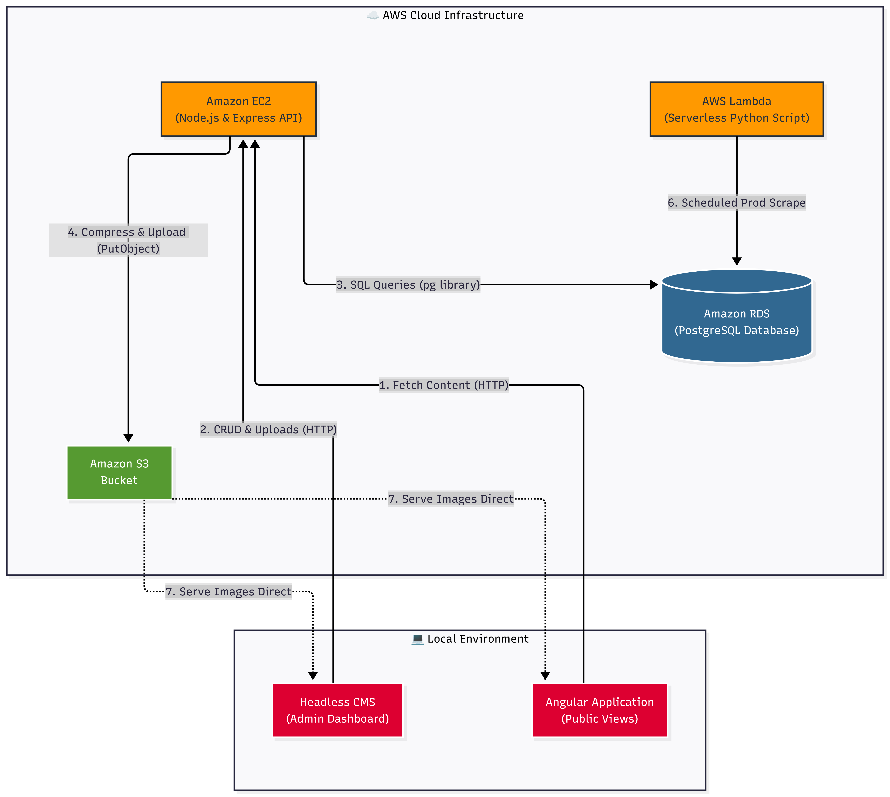

Local (staging/dev)


# Terminal 1 — backend (uses .env, connects to localhost DB by default)
node server/index.js

# Terminal 2 — frontend (uses environment.ts → localhost:3000)
npm start
# → ng serve → http://localhost:4200
Production


# 1. Build frontend with prod config (swaps environment.prod.ts)
npm run build
# Output goes to dist/leavesshop/browser/

# 2. Serve the dist/ folder via nginx or serve it from the EC2 Node server
# Option A: have Express serve the Angular build
# Add to server/index.js (before the listen call):
#   const path = require('path');
#   app.use(express.static(path.join(__dirname, '../dist/leavesshop/browser')));
#   app.get('*', (req, res) => res.sendFile(path.join(__dirname, '../dist/leavesshop/browser/index.html')));

# 3. Start the backend on EC2
node server/index.js
# Or with PM2 (recommended for production):
pm2 start server/index.js --name music-blog
Key differences per env

Local	Production
apiUrl	http://localhost:3000/api	http://56.124.116.216:3000/api
ng build config	development (default for ng serve)	production (npm run build)
ALLOWED_ORIGINS in .env	http://localhost:4200	your real domain
DB	local postgres or RDS	RDS
To test prod build locally (e.g. verify the bundle before deploying):


npm run build
npx serve dist/leavesshop/browser
This serves the production bundle at localhost:3000 but still hits whatever apiUrl is set in environment.prod.ts.

The provided code snippet appears to be a mix of HTML, CSS, and JavaScript files for a web application. It includes various components such as a search bar, post list, and meta actions. However, without more context or information about the specific functionality or requirements of this code, it's challenging to provide a comprehensive review.

That being said, here are some observations and potential improvements:

1. **Organization**: The code is not well-organized, with multiple files containing different types of content (HTML, CSS, JavaScript). It would be better to separate these into distinct files for each component.
2. **CSS Structure**: The CSS file (`article-search.css`) contains a lot of nested rules and uses the `!important` keyword excessively. This can make maintenance and debugging more difficult. Consider using a more modular approach to your CSS, such as using classes or IDs instead of inline styles.
3. **JavaScript**: There is no JavaScript code provided in the snippet. However, if there were any JavaScript files, they would likely be used for dynamic functionality, such as handling form submissions, API requests, or animations.
4. **HTML Structure**: The HTML structure appears to be basic and straightforward. However, it's essential to ensure that the HTML is semantic and follows best practices for accessibility.
5. **CSS Preprocessors**: There are no CSS preprocessors (e.g., Sass, Less) used in the code snippet. If you're using a preprocessor, consider migrating your styles to use its features, such as variables, mixins, or nesting.
6. **Vendor Prefixes**: The code uses vendor prefixes for certain properties (e.g., `box-shadow`, `border-radius`). While these are necessary for older browsers, it's recommended to use the unprefixed versions in modern browsers and add vendor prefixes only when necessary.

To improve this code, consider the following steps:

1. **Separate files**: Organize your HTML, CSS, and JavaScript into distinct files for each component.
2. **Use a modular approach**: Break down your CSS into smaller, more manageable pieces using classes or IDs instead of inline styles.
3. **Follow best practices**: Ensure that your HTML is semantic and follows accessibility guidelines.
4. **Consider preprocessors**: If you're not already using a preprocessor, consider migrating your styles to take advantage of its features.
5. **Remove unnecessary code**: Remove any unnecessary code, such as the `!important` keyword, to make maintenance and debugging easier.

Here's an example of how you could refactor the CSS file to use a more modular approach:
```css
/* article-search.css */

// Define a class for the search bar
.search-bar {
  background-color: rgba(255, 255, 255, 0.8);
  border: 1px solid #333;
  padding: 14px 20px;
  border-radius: 30px;
}

// Define a class for the post list
.post-list {
  display: flex;
  flex-direction: column;
  gap: 4rem;
  margin-left: 2.4rem;
}

// Define a class for individual posts
.post {
  text-decoration: none;
  color: inherit;
  display: flex;
  flex-direction: row;
  justify-content: space-between;
  align-items: center;
  gap: 1.5rem;
  border: 1px solid #333;
  border-radius: 16px;
  padding: 3.5rem;
  background-color: rgba(255, 255, 255, 0.03);
}

// Define a class for the meta actions
.meta-actions {
  display: flex;
  justify-content: end;
  gap: 1rem;
  bottom: 1rem;
  position: relative;
  overflow: visible;
  margin-bottom: 40px;
}
```
This refactored CSS uses classes to define styles, making it easier to maintain and modify the code.
