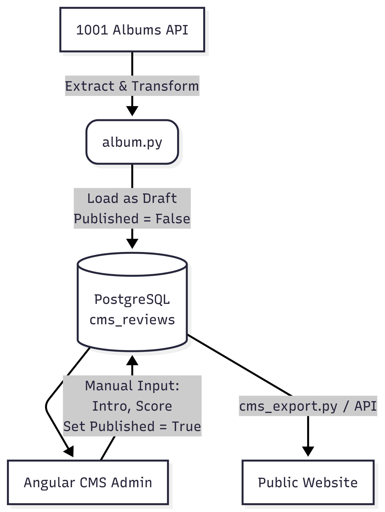

Based on the provided code snippets, I'll provide a detailed explanation of the code structure and functionality.

**Overview**

The application appears to be a music blog or website with features such as:

* Articles page: displays a list of articles with filtering options (e.g., theme, search)
* Collection page: displays a collection of items with filtering options
* CMS API: provides an interface for managing content

**Key Components and Services**

1. **ArticlesPage Component**: responsible for rendering the articles page, including filtering and searching functionality.
2. **ReviewCmsService**: provides access to the CMS API, allowing retrieval of review data.
3. **CMS API**: a RESTful API that manages review data.

**Code Structure**

The code is organized into several files:

1. `articles-page.html`: defines the HTML structure for the articles page.
2. `articles-page.css`: styles the articles page.
3. `articles-page.ts`: implements the logic for the articles page, including filtering and searching functionality.
4. `review-cms.service.ts`: provides access to the CMS API.
5. `cms-api.config.ts`: defines the base URL for the CMS API.

**Key Functions and Logic**

1. **ArticlesPage Component**:
	* `searchTerm()`: returns the current search term value.
	* `selectedTheme()`: returns the currently selected theme value.
	* `isExpanded()`: returns a boolean indicating whether the "Show More" button should be displayed.
	* `filteredArticles()`: filters the articles based on the search term and selected theme.
2. **ReviewCmsService**:
	* `getListMeta()`: retrieves the list meta data from the CMS API.
	* `getReviewById()` and `getReviewBySlug()`: retrieve a review by ID or slug, respectively.

**CMS API**

The CMS API is not explicitly defined in the provided code snippets. However, based on the `review-cms.service.ts` file, it appears to be a RESTful API that manages review data, including:

* Retrieving list meta data
* Retrieving reviews by ID or slug

**Collection Page**

The collection page is not explicitly defined in the provided code snippets. However, based on the `collection-page.css` file, it appears to be a component that displays a collection of items with filtering options.

Overall, the application appears to be a music blog or website with features such as articles, collections, and CMS API integration. The code structure is organized into several files, each responsible for implementing specific functionality.